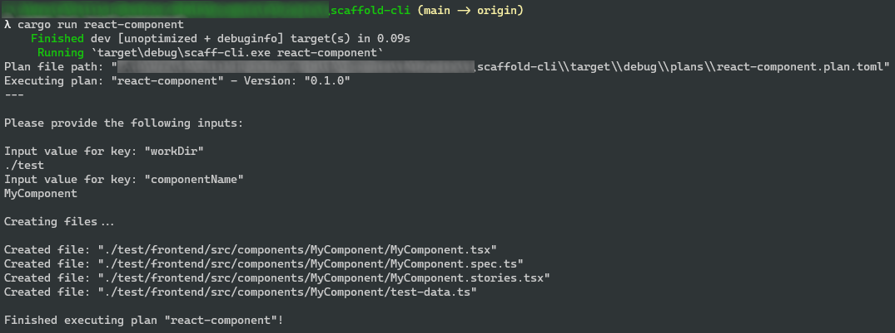

# Scaffold CLI

A small Rust program that can scaffold projects, files and more using a plan and template files.

## Example use case

Working in a frontend project, for instance React.
A new component has to be made, but alongside it, a test file needs to be created, a Storybook stories file and perhaps a file witch contains test data useful for both the tests and the Storybook stories.

A Scaffold CLI plan is created (in TOML) as well as some template files.

Now the plan can be run and will create all files defined in the plan with keys replaced by input values, for instance the component name.

## Running the program

You need to have a plan you want to run in the `plans` folder placed alongside the program (running this project using cargo run, the `plans` folder should be in `target/debug`).
A plan consists of a plan configuration file (a file ending in `.plan.toml`) as well as a folder with the plan's name containing the template files.

```
my-plan.plan.toml
my-plan
 - component.template.ts
 - ...
```

After this, you run the program with the name of the plans file (without the extension `.plan.toml`).

You will be prompted to write the inputs defined in the plan.

The paths to the created files will be displayed.

## Example plan

The example plan is an example of creating files related to a React component.

The plan looks as follows:

```TOML
[meta]
name = "react-component"
version = "0.1.0"

[inputs]
inputs = ["workDir", "componentName"]

[[files]]
template_file = "component.template.tsx"
output_file = "{{workDir}}/frontend/src/components/{{componentName}}/{{componentName}}.tsx"

[[files]]
template_file = "spec.template.ts"
output_file = "{{workDir}}/frontend/src/components/{{componentName}}/{{componentName}}.spec.ts"

[[files]]
template_file = "storybook.template.tsx"
output_file = "{{workDir}}/frontend/src/components/{{componentName}}/{{componentName}}.stories.tsx"

[[files]]
template_file = "test-data.template.ts"
output_file = "{{workDir}}/frontend/src/components/{{componentName}}/test-data.ts"
```

The output will be the following.



The files also use the {{ KEY }} syntax to have values inserted instead of the key.
